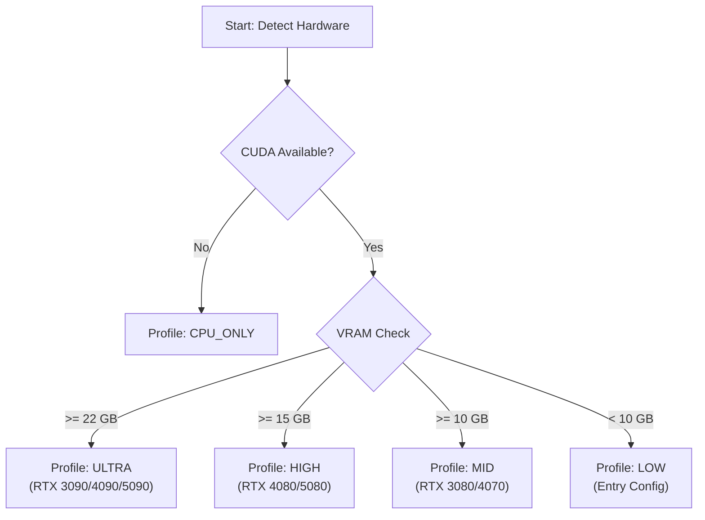
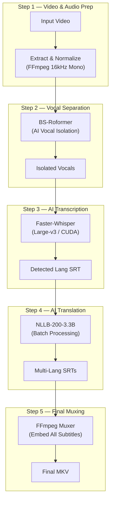

<div align="center">
  
</div>


# **Auto Subtitle Generator (RTX 5090 & Ryzen 9950X3D Optimized)**

[](https://www.python.org/)


A high-performance, **100% Local AI pipeline** designed to restore, transcribe, and translate video subtitles completely offline.  
This project is engineered for "Bleeding Edge" hardware (NVIDIA RTX 50-series + AMD Ryzen 9000 series), featuring **Automatic Hardware Detection** to maximize performance on any system.


> [!NOTE]
> **Quick Start:** Drag & Drop your video file (or folder) onto the `auto_subtitle.py` script to start processing immediately.

## **🌟 Key Features**

### **1. Hardware Auto-Detection (SystemOptimizer)**

The script intelligently scans your system resources at startup to apply the absolute best settings:


```mermaid
graph TD
    A[Start: Detect Hardware] --> B{CUDA Available?}
    B -- No --> C[Profile: CPU_ONLY]
    B -- Yes --> D{VRAM Check}
    D -- ">= 22 GB" --> E["Profile: ULTRA<br/>(RTX 3090/4090/5090)"]
    D -- ">= 15 GB" --> F["Profile: HIGH<br/>(RTX 4080/5080)"]
    D -- ">= 10 GB" --> G["Profile: MID<br/>(RTX 3080/4070)"]
    D -- "< 10 GB" --> H["Profile: LOW<br/>(Entry Config)"]
```

#### **Auto-Tuned Configuration Profiles**

The system automatically selects one of the following profiles based on your detected VRAM:

| Profile | VRAM Trigger | Whisper Beam Size | NLLB Batch Size | Compute Precision | Target GPU |
| :--- | :--- | :---: | :---: | :---: | :--- |
| **ULTRA** | 22 GB+ | 5 | 32 | `float16` | RTX 3090 / 4090 / 5090 |
| **HIGH** | 15 GB+ | 5 | 64 | `float16` | RTX 4080 / 5080 |
| **MID** | 10 GB+ | 5 | 32 | `float16` | RTX 3080 / 4070 |
| **LOW** | < 10 GB | 2 | 8 | `int8_float16` | RTX 3060 / 2060 |
| **CPU** | N/A | 2 | 4 | `int8` | No GPU Found |

*   **ULTRA (RTX 5090 - 32GB VRAM):**
    *   **Massive Parallelism:** Uses Batch Size 64 to translate 30+ languages in seconds.
    *   **Full CPU Power:** Utilizes all available threads (e.g., 32 threads on Ryzen 9950X3D) for FFmpeg operations.
*   **CPU Fallback:** Seamlessly switches to CPU-only inference if no GPU is found.

### **2. Technical Specifications**

This application is built with specific optimizations for high-end hardware but remains backward compatible.

*   **App Engine:** Python 3.10+ Native w/ PyTorch Nightly (CUDA 12.6+).
*   **CPU Optimization:** 
    *   **Ryzen 9000 Series (9950X3D):** Detects core count and assigns one FFmpeg thread per core minus OS overhead.
    *   **Instruction Sets:** AVX2/AVX512 optimizations enabled for PyTorch CPU operations.
*   **GPU Optimization:**
    *   **RTX 50-Series (Blackwell):** Native FP16 Tensor Core utilization.
    *   **VRAM Management:** Dynamic aggressive garbage collection between Whisper and NLLB stages to prevent OOM.
    *   **Smart OOM Recovery:** Automatically detects memory saturation (**both GPU VRAM and CPU/System RAM**) during translation, clears cache, and dynamically adjusts batch sizes to prevent crashes without user intervention.

### **3. Full GPU AI Processing**

*   **Transcription:** Faster-Whisper (Large-v3) running natively on CUDA.
*   **Translation:** NLLB-200-3.3B model running in FP16 on the GPU.

### **4. VHS Audio Restoration**

*   **Noise Removal:** Automatically applies a high-pass filter chain via FFmpeg to remove tape hiss, low-frequency rumble, and static common in 90s/00s recordings.  
*   **32-bit Precision:** Audio is processed in **32-bit float** to prevent clipping and ensure pristine quality for the AI models.

### **5. Language Support**

Generates subtitles simultaneously for a vast array of languages, organized by global reach:

*   **Tier 1 (Global):** English, Chinese, Hindi, Spanish, French, Arabic, Russian, Portuguese, etc.
*   **Tier 2 (Regional):** Turkish, Vietnamese, Korean, Italian, Polish, Dutch, etc.
*   **Tier 3 (Various):** Full support for ~50 additional languages including Scandinavian, Eastern European, and Asian variants.

### **6. Persistent Model Loading**

*   **Batch Processing Optimized:** The specialized `ModelManager` loads heavy AI models (Whisper, NLLB) only once per session, drastically reducing processing time for folders containing multiple videos.
*   **Smart Caching:** Re-uses loaded models across multiple files without the overhead of re-initialization.

## **🚀 Processing Pipeline**


```mermaid
graph TD
    subgraph Step1 ["Step 1 — Video & Audio Prep"]
        A["Input Video"] --> B["Extract & Normalize<br/>(FFmpeg 16kHz Mono)"]
    end

    subgraph Step2 ["Step 2 — Vocal Separation"]
        B --> V["BS-Roformer<br/>(AI Vocal Isolation)"]
        V --> VC["Isolated Vocals"]
    end
    
    subgraph Step3 ["Step 3 — AI Transcription"]
        VC --> W["Faster-Whisper<br/>(Large-v3 / CUDA)"]
        W --> S1["Detected Lang SRT"]
    end

    subgraph Step4 ["Step 4 — AI Translation"]
        S1 --> N["NLLB-200-3.3B<br/>(Batch Processing)"]
        N --> S2["Multi-Lang SRTs"]
    end

    subgraph Step5 ["Step 5 — Final Muxing"]
        S2 --> MUX["FFmpeg Muxer<br/>(Embed All Subtitles)"]
        MUX --> OUT["Final MKV"]
    end
```

## **🛠️ Prerequisites**

*   **OS:** Windows 10/11 (64-bit)
*   **GPU:** NVIDIA RTX 3000/4000/5000 Series (Recommended).
*   **Python:** 3.10 or newer.

## **📦 Installation**

1.  **Clone the repository.**
2.  Run the Installer:
    Double-click `install_dependencies.ps1`.
    *   Automatically fetches **PyTorch Nightly** (CUDA 12.6+) required for RTX 50-series support.
    *   Installs FFmpeg and all necessary AI libraries.

## **🎮 Usage**

### **Method 1: Drag and Drop (Recommended)**

Simply **drag and drop** a video file (or a folder containing multiple videos) directly onto the `auto_subtitle.py` file.

The script will launch and automatically process the video(s) using settings defined in `config.yaml`.
- By default, it uses an optimized multilingual prompt.
- You can customize this behavior in `config.yaml`.

### **Method 2: Command Line**

```bash
python auto_subtitle.py "E:\My Videos\Vacation 1998.mkv"
```

The script will produce:
*   `video.ro.srt` (Original Language)
*   `video.en.srt` (English Translation)
*   ...and so on for all configured languages.
*   `video_multilang.mkv` (Final video with all subtitles embedded).

## **⚙️ Customization**

### **Configuration File (`config.yaml`)**
All settings are now managed via `config.yaml` (automatically created on first run if missing).

```yaml
# Example config.yaml
whisper:
  model_size: "large-v3"
  use_prompt: true
  custom_prompt: "This video contains medical terminology..."

hallucinations:
  silence_threshold: 0.1
  repetition_threshold: 5
  known_phrases:
    - "thanks for watching"

target_languages:
  en: {code: "eng_Latn", label: "English"}
  es: {code: "spa_Latn", label: "Spanish"}
```

> [!TIP]
> **Performance Note**
>
> *   **RTX 5090 Users:** Expect real-time or faster-than-real-time performance. The "ULTRA" profile is specifically tuned for your 32GB VRAM.
> *   **Ryzen 9950X3D Users:** The script will automatically detect your 32-thread capacity and maximize FFmpeg throughput.
