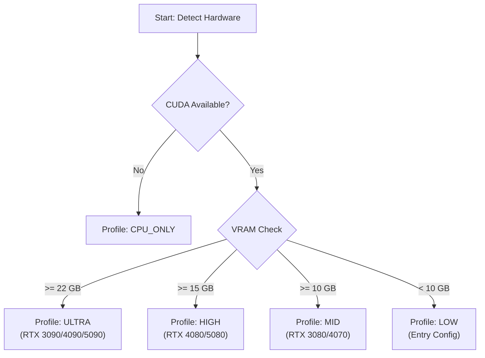
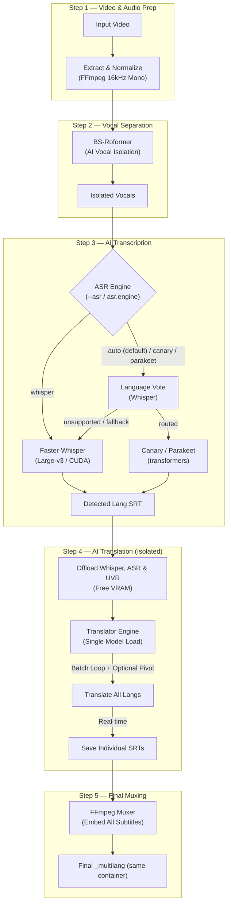

# Auto Subtitle Generator (RTX 5090 & Ryzen 9950X3D Optimized)


[](https://www.python.org/)

[](https://github.com/ventura8/Auto-Subtitle-Generator/releases)

A high-performance, **100% Local AI pipeline** designed to restore, transcribe,
and translate video subtitles completely offline.\
This project is engineered for "Bleeding Edge" hardware (NVIDIA RTX 50-series +
AMD Ryzen 9000 series), featuring **Automatic Hardware Detection** to maximize
performance on any system.

> [!NOTE] **Quick Start:** Drag & Drop your video file (or folder) onto the
> `auto_subtitle.py` script. **Pro Tip:** Just press `Enter` at the prompt to
> automatically process the `input` folder.

## **📝 Release Notes**

- v1.3.0: [docs/releases/v1.3.0.md](docs/releases/v1.3.0.md)
- v1.2.9: [docs/releases/v1.2.9.md](docs/releases/v1.2.9.md)
- GitHub release body (copy-ready): [docs/releases/v1.3.0_github_description.md](docs/releases/v1.3.0_github_description.md)
- v1.2.8: [docs/releases/v1.2.8.md](docs/releases/v1.2.8.md)
- v1.2.7: [docs/releases/v1.2.7.md](docs/releases/v1.2.7.md)
- v1.2.6: [docs/releases/v1.2.6.md](docs/releases/v1.2.6.md)
- v1.2.5: [docs/releases/v1.2.5.md](docs/releases/v1.2.5.md)
- Earlier releases: [docs/releases/](docs/releases/)

## **🌟 Key Features**

### **0. AI Contextual Seeding & Prompting**

- **Automatic Context:** Uses the video filename to prime Whisper's context,
  drastically reducing hallmark hallucinations like "Like and Subscribe" on
  silent/noisy periods.
- **No-Force Sensitivity:** Intelligently biases the transcription with
  native-language hints (from a robust audio scan) while allowing Whisper to
  choose the final language organically, ensuring accuracy on bilingual or noisy
  content.

### **1. Hardware Auto-Detection (SystemOptimizer)**

The script intelligently scans your system resources at startup to apply the
absolute best settings:


```mermaid
graph TD
    A[Start: Detect Hardware] --> B{CUDA Available?}
    B -- No --> C[Profile: CPU_ONLY]
    B -- Yes --> D{VRAM Check}
    D -- ">= 22 GB" --> E["Profile: ULTRA<br/>(RTX 3090/4090/5090)"]
    D -- ">= 15 GB" --> F["Profile: HIGH<br/>(RTX 4080/5080)"]
    D -- ">= 10 GB" --> G["Profile: MID<br/>(RTX 3080/4070)"]
    D -- "< 10 GB" --> H["Profile: LOW<br/>(Entry Config)"]
```

#### **Auto-Tuned Configuration Profiles**

The system automatically selects one of the following profiles based on your
detected VRAM:

| Profile | VRAM Trigger | NLLB Batch Size | Compute Precision | Target GPU | |
:--- | :--- | :---: | :---: | :--- |
| **ULTRA** | 22 GB+ | 32 (Max) | `float16` | RTX 3090 / 4090 / 5090 |
| **HIGH** | 15 GB+ | 16 (Max) | `float16` | RTX 4080 / 5080 |
| **MID** | 10 GB+ | 8 (Max) | `float16` | RTX 3080 / 4070 |
| **LOW** | < 10 GB | 4 (Max) | `int8_float16` | RTX 3060 / 2060 |
| **CPU** | N/A | 1 | `int8` | No GPU Found |

- **ULTRA (RTX 5090 - 32GB VRAM):**
  - **High-Fidelity Transcription:** Uses Sequential Whisper with Tuned VAD for
    100% start-of-video accuracy.
  - **Massive Translation Parallelism:** Uses Dynamic Batching (up to 64) for
    NLLB to translate 30+ languages in seconds.
  - **Full CPU Power:** Utilizes all available threads (e.g., 32 threads on
    Ryzen 9950X3D) for FFmpeg operations.
- **CPU Fallback:** Seamlessly switches to CPU-only inference if no GPU is
  found.

### **2. Technical Specifications**

This application is built with specific optimizations for high-end hardware but
remains backward compatible.

- **App Engine:** Python 3.12.x Native w/ PyTorch Stable (CUDA 13.2).
- **CPU Optimization:**
  - **Ryzen 9000 Series (9950X3D):** Detects core count and assigns one FFmpeg
    thread per core minus OS overhead.
  - **Instruction Sets:** AVX2/AVX512 optimizations enabled for PyTorch CPU
    operations.
- **GPU Optimization:**
  - **RTX 50-Series (Blackwell):** Native FP16 Tensor Core utilization.
  - **Strict VRAM Enforcement:** Forces all models (NLLB/Whisper) to reside
    strictly in VRAM. Prevents "spillover" to slow shared system RAM, ensuring
    maximum performance and preventing system lag.
  - **Smart Memory Management:** Proactive garbage collection and caching inside
    translation loops to prevent fragmentation.
  - **Smart OOM Recovery:** Automatically detects memory saturation and
    dynamically adjusts batch sizes (hard-capped for stability).

### **3. Full GPU AI Processing**

- **Transcription:** Faster-Whisper (Large-v3) running natively on CUDA for
  every language that `auto` routing does not send elsewhere, or for all of
  them with `--asr whisper`. Two NVIDIA engines are available (`--asr` or
  `asr.engine`):
  - `canary` — [NVIDIA Canary-1B-v2](https://huggingface.co/nvidia/canary-1b-v2).
    Published FLEURS results put it ahead of Whisper on Romanian and 14 other
    European languages. It cannot detect the language itself, so Whisper
    detects it first.
  - `parakeet` — [NVIDIA Parakeet-TDT-0.6B-v3](https://huggingface.co/nvidia/parakeet-tdt-0.6b-v3).
    Much faster than Whisper, less accurate.
  - `auto` — detect the language with Whisper (a vote over 8 windows spread
    across the whole file, so an English intro does not decide it), then use
    the engine listed for that language in `asr.routes`. This is the
    default. Out of the box Romanian, Bulgarian, Croatian, Estonian, Latvian,
    Lithuanian, Maltese, Slovak and Slovenian go to Canary; every other
    language stays on Whisper.
  - Both NVIDIA models cover 25 European languages and run through the
    `transformers` already installed (no NeMo). An unsupported language, a
    model that does not load or fit, or output that is mostly empty falls back
    to Whisper with a logged warning.
  - **Why those languages:** on the full FLEURS test splits Canary cut word
    errors (diacritics counted) by 20-73 % against Whisper large-v3 in each of
    them, e.g. Romanian 8.91 % → 6.90 %, and halved Romanian long-form errors
    with three times tighter cue timing. Whisper stayed as good or better in
    English, German, French, Spanish, Italian, Portuguese, Dutch, Polish,
    Russian, Ukrainian and the Nordic languages. Parakeet is the fastest
    engine but was never the most accurate. Tables:
    [docs/hardware_optimization.md](docs/hardware_optimization.md#benchmark-results).
- **Translation:** Configurable engine via `config.yaml`:
- `nllb` (default, fast and stable; uses NLLB batch translation flow)
- `translategemma` (higher quality, high VRAM requirement; does not use NLLB
  worker-batch lifecycle assumptions)
- **Engine lifecycle note:** `nllb` caches a single translator model instance
  per video and applies batched all-language translation in one lifecycle;
  `translategemma` follows its own generation lifecycle and does not reuse the
  NLLB batch-worker model-loading path.

### **4. VHS Audio Restoration**

- **Noise Removal:** Automatically applies a high-pass filter chain via FFmpeg
  to remove tape hiss, low-frequency rumble, and static common in 90s/00s
  recordings.
- **32-bit Precision:** Audio is processed in **32-bit float** to prevent
  clipping and ensure pristine quality for the AI models.

### **5. Language Support**

Generates subtitles simultaneously for a vast array of languages, organized by
global reach:

- **Tier 1 (Global):** English, Chinese, Hindi, Spanish, French, Arabic,
  Russian, Portuguese, etc.
- **Tier 2 (Regional):** Turkish, Vietnamese, Korean, Italian, Polish, Dutch,
  etc.
- **Tier 3 (Various):** Full support for ~50 additional languages including
  Scandinavian, Eastern European, and Asian variants.

### **6. Reliability & Stability**

- **Robust Windows Shutdown:** Implements a custom Windows Console Handler
  (`SetConsoleCtrlHandler`) to intercept "X" button clicks, ensuring all
  background processes (FFmpeg, AI workers) are instantly and safely terminated.
- **Persistent Model Loading:** The specialized `ModelManager` loads heavy AI
  models only once per session, drastically reducing processing time for
  folders.

### **7. Real-Time UI**

- **Dynamic Tech Banner:** Displays real-time hardware statistics (CPU Model,
  Core Count, GPU VRAM) and auto-tuned internal settings at startup.
- **Live Feedback:** Single-line, glitch-free progress updates for all stages.
- **Precision Tracking:** Displays real-time transcription status with
  timestamps and live text preview.

### **8. Smart Resume & Reliability**

- **Atomic Saves:** Subtitles are saved to disk *immediately* after each
  individual language is translated, preventing data loss if the process is
  interrupted.
- **One Work Directory Per Video:** Every temporary file (extracted audio,
  isolated vocals, translation manifests and worker outputs, the recorded
  source language, and in-flight scratch files) lives in
  `<video name>.asg-temp/` next to the video. Nothing else is written beside
  the video except the final `.srt` files and the `_multilang` container.
- **Resume After Power Loss:** The work directory is kept whenever a video
  does not finish (crash, Ctrl+C, power outage, failed stage), so the next run
  reuses the extracted audio, the isolated vocals, the source SRT, the English
  pivot, and every translated SRT that already exists. Truncated or stale
  intermediates are detected and redone.
- **Nothing Left Behind:** Once a video is muxed (or found to contain no
  speech, or skipped because its output already exists) the work directory
  is removed, and legacy sidecars from older releases are swept from the video
  folder.
- **Untrusted Input Folders Are Safe:** A video is only processed if it is a
  plain regular file inside the folder you selected. Symlinks and Windows
  junctions are skipped with a warning, and the pipeline keeps the validated
  file open for the whole run so FFmpeg reads exactly that file — a link or
  directory swapped in afterwards (on a USB stick or a shared folder) can
  never make it read, transcribe, or copy media from elsewhere on your machine.
  On Windows the input is copied to `%TEMP%` for the duration of its run.
- **VRAM-Aware Tuning:** The translation model is chosen to fit the card
  (`models.nllb: auto` picks NLLB-3.3B from 11 GB, the distilled 1.3B from
  5 GB, the distilled 600M below), Whisper drops to int8 weights on small
  cards, and the translation batch is sized from the VRAM actually free after
  the model loads, so a shared or smaller GPU gets a smaller batch instead of
  an out-of-memory fallback to the CPU. `performance.max_vram_usage_gb` caps
  what the pipeline plans against.
- **Multi-Hour Videos:** Vocal separation runs in 30-minute chunks (configurable
  via `separation_chunk_minutes`), so a 4-hour recording never needs more than a
  few gigabytes of RAM and no intermediate file ever approaches the 4 GB WAV
  limit. Each finished chunk is kept as resume state, and the joined vocal
  track is 16 kHz mono, the format Whisper consumes, so it stays small.
  Transcription, translation, and muxing already stream or window internally;
  the Canary/Parakeet path reads the audio span by span and runs voice
  detection in 10-minute blocks, so it never holds a multi-hour file in RAM.
- **Model Download Integrity & Auto-Recovery:** Every downloaded AI model and
  tokenizer checkpoint (`BS-Roformer`, `Faster-Whisper`, `Canary`, `Parakeet`,
  `NLLB`, `TranslateGemma`) automatically detects corrupted or truncated downloads,
  purges the stale cache, and re-downloads cleanly without crashing.
- **Intelligent Skip:**
  - Automatically skips videos that already have a final `_multilang` output for
    the same container extension.
  - Skips individual languages if a valid `.srt` file already exists.
  - Verifies SRT integrity before skipping (re-processes empty or corrupted
    files).
- **Batching & Caching (NLLB only):** The NLLB model is loaded **once** per
  video (in a separate process) to translate all 30+ languages, eliminating
  repetitive loading times.
- **TranslateGemma lifecycle:** Translation runs through the TranslateGemma
  generation flow and does not use NLLB's single-worker batch cache lifecycle.
- **Per-File Summary Metrics:** At the end of each file, the pipeline prints
  total processing speed, media duration, and elapsed processing time.
- **Batch Summary Metrics:** For multi-file runs, the pipeline prints aggregate
  counts/speed plus a per-file stats list (status, media duration, elapsed,
  speed).

## **🚀 Processing Pipeline**


```mermaid
graph TD
    subgraph Step1 ["Step 1 — Video & Audio Prep"]
        A["Input Video"] --> B["Extract & Normalize<br/>(FFmpeg 16kHz Mono)"]
    end

    subgraph Step2 ["Step 2 — Vocal Separation"]
        B --> V["BS-Roformer<br/>(AI Vocal Isolation)"]
        V --> VC["Isolated Vocals"]
    end

    subgraph Step3 ["Step 3 — AI Transcription"]
        VC --> ASR{"ASR Engine<br/>(--asr / asr.engine)"}
        ASR -- "whisper" --> W["Faster-Whisper<br/>(Large-v3 / CUDA)"]
        ASR -- "auto (default) / canary / parakeet" --> LID["Language Vote<br/>(Whisper)"]
        LID -- "routed" --> NV["Canary / Parakeet<br/>(transformers)"]
        LID -- "unsupported / fallback" --> W
        W --> S1["Detected Lang SRT"]
        NV --> S1
    end

    subgraph Step4 ["Step 4 — AI Translation (Isolated)"]
        S1 --> OFF["Offload Whisper, ASR & UVR<br/>(Free VRAM)"]
        OFF --> N["Translator Engine<br/>(Single Model Load)"]
        N -- "Batch Loop + Optional Pivot" --> T["Translate All Langs"]
        T -- "Real-time" --> S2["Save Individual SRTs"]
    end

    subgraph Step5 ["Step 5 — Final Muxing"]
        S2 --> MUX["FFmpeg Muxer<br/>(Embed All Subtitles)"]
        MUX --> OUT["Final _multilang (same container)"]
    end
```

## **🛠️ Prerequisites**

- **OS:** Windows, Linux, or macOS (64-bit).
- **GPU:** NVIDIA RTX 3000/4000/5000 Series (Recommended).
- **Python:** 3.12.x only.

## **📦 Installation & Quick Start**

### **One-Click Auto-Installing Launchers (Recommended)**

Download and extract the matching release bundle, then run the auto-installing
launcher for your platform:

- **Windows:** Double-click or run `start.exe`.
- **Linux / macOS:** Run `./start` (or `./start.sh`).

Release bundles contain the launcher, application source, configuration, and
platform installer, but no prebuilt Python environment or AI models. The
launcher automatically detects if the Python 3.12 environment is present. If
missing, it automatically invokes the setup installer
(`install_dependencies.ps1` or `install_dependencies.sh`) to bootstrap the
complete runtime, then executes the pipeline.

### **Manual Setup**

1. **Clone the repository.**
1. Install **FFmpeg** on your system (e.g., via `winget install ffmpeg` or
   `choco install ffmpeg` on Windows, your Linux package manager, or Homebrew on
   macOS). An installed FFmpeg is always preferred. On Windows only, when no
   `ffmpeg`/`ffprobe` is on `PATH`, `install_dependencies.ps1` falls back to a
   pinned, SHA256-verified gyan.dev 9.0.2 build in `.venv\ffmpeg`;
   `install_dependencies.sh` stops unless FFmpeg is installed or present in
   `.venv/bin`.
1. Run the platform installer:
   - **Windows:** `./install_dependencies.ps1`
   - **Linux, macOS, or WSL2:** `./install_dependencies.sh`
1. The installer fetches the production runtime profile (`main + ml`). On
   supported NVIDIA systems, PyTorch uses the CUDA 13.2 runtime (with RTX
   50-series support). The installer keeps any Faster-Whisper compatibility
   runtime isolated from the CUDA 13 libraries.

### **Dependency Profiles**

- **Production runtime**: installs `main + ml` groups (heavy AI stack included).
  - Used by `install_dependencies.ps1` and `install_dependencies.sh`.
- `install_dependencies.sh` accepts an optional comma-separated group list, for
  example `./install_dependencies.sh ml,dev`; only `ml` and `dev` are valid.
- **Test/local quality gate**: installs `main + dev` groups **without** `ml`.
  - Used by `run_local_pipeline.ps1` and `run_local_pipeline.sh` to validate
    logic against real light dependencies without GPU-heavy packages.
- **ASR benchmark** (optional): the `bench` group adds `pyarrow`, which only
  the VoxPopuli section of the benchmark harness needs. Results go to
  `.cache/asr_benchmark/`.

```bash
poetry install --no-root --with ml,dev,bench
poetry run python -m tests.tools.asr_benchmark \
  --engines whisper,canary,parakeet --langs ro_ro --limit 200
```

## **🎮 Usage**

### **Method 1: Launcher / Drag and Drop (Recommended)**

Simply run `start.exe` / `./start` or **drag and drop** a video file (or folder)
directly onto `start.exe` or `auto_subtitle.py`.

The script will launch and automatically process the video(s) using settings
defined in `config.yaml`.

- By default, it uses an optimized multilingual prompt.
- You can customize this behavior in `config.yaml`.

### **Method 2: Command Line**

```bash
# Using the launcher:
./start "/path/to/my_video.mkv"

# Or directly with Python:
.venv/bin/python auto_subtitle.py "/path/to/my_video.mkv"

# Route Romanian to NVIDIA Canary, keep Whisper for everything else:
.venv/bin/python auto_subtitle.py --asr auto "/path/to/my_video.mkv"
```

Command-line options:

| Option | Meaning |
| :--- | :--- |
| `--lang ro` | Force the source language (skips language detection). |
| `--prompt "..."` | Custom initial prompt for Whisper. |
| `--cpu` | Force CPU-only inference. |
| `--asr ENGINE` | `whisper`, `canary`, `parakeet`, `auto`; overrides config. |
| `--version` | Print the version and exit. |

The script will produce:

- `video.ro.srt` (Original Language)
- `video.en.srt` (English Translation)
- ...and so on for all configured languages.
- `video_multilang.<input_extension>` (Final video with all subtitles embedded
  using the same container as input).

At the end of each processed file, the script also prints:

- `Total processing speed`
- `Media duration`
- `Elapsed`

When processing multiple files, the script additionally prints:

- `Batch Summary` (total files, succeeded/no-speech/failed, media duration,
  elapsed, total speed)
- `Batch Files` list (per-file status, media duration, elapsed, speed)

## **✅ Local Quality Gate**

Run the full local validation pipeline:

```powershell
.\run_local_pipeline.ps1
```

Developer note: the local pipeline auto-installs **GitHub CLI** (`gh`) and
attempts **MCP CLI** setup (`mcp`) for PR review/comment workflows.

This step validates Markdown quality (auto-delint + lint), code linting, and
tests, enforces coverage threshold, runs security checks, and regenerates
coverage artifacts.

It enforces:

- Zero-suppression policy scan (`tests/tools/check_no_suppressions.py`)
- Ruff + Flake8 + Pylint
- Bandit (high severity/high confidence) + pip-audit
- Pytest with warnings-as-errors and 90% coverage gates

The quality gate installs `main + dev` dependencies while excluding the heavy
`ml` group.

Coverage is enforced at **at least 90%** (`--cov-fail-under=90`).

### **📦 Dependency Notes**

The `ml` group deliberately does **not** pin `nvidia-cublas`, `nvidia-cuda-nvrtc`
or `nvidia-nvjitlink`. `torch` pulls `cuda-toolkit`, and the two `torch` entries
resolve to different `cuda-toolkit` versions (13.2.1 for the `+cu132` build,
13.0.3 for the plain PyPI build macOS selects), which require different
`nvidia-*` versions. Pinning for one branch makes the lock unsolvable for the
other. `nvidia-cudnn-cu13` stays pinned only because both builds agree on it.

Dependency markers carry only `platform_system`. `requires-python` already pins
3.12, so repeating `python_version` / `implementation_name` on every entry only
enlarges the marker space Poetry must intersect. With them present,
`poetry lock` does not terminate.

### **🛰️ SonarQube Cloud**

Static analysis is additionally reported to
[SonarQube Cloud](https://sonarcloud.io/summary/new_code?id=ventura8_Auto-Subtitle-Generator).
Analysis settings live in `sonar-project.properties`; the CI job reuses the
`coverage.xml` produced by the test stage rather than re-running the suite.

The scan runs in CI only — it needs the `SONAR_TOKEN` repository secret, and it is
skipped for pull requests from forks, where secrets are unavailable. The quality
gate blocks the build on failure.

To scan locally, export a token from **My Account → Security** on sonarcloud.io:

```bash
poetry run pytest -m "not e2e" --cov=auto_subtitle --cov=modules \
  --cov-branch --cov-report=xml tests/

SONAR_TOKEN="<token>" npx --yes sonarqube-scanner \
  -Dsonar.host.url=https://sonarcloud.io
```

Automatic Analysis is deliberately **off** on the SonarCloud project: it cannot
ingest a coverage report, so coverage would read 0%, and it conflicts with CI
analysis. Leave it off.

The zero-suppression policy extends to Sonar: never add `# NOSONAR` or resolve a
finding as "Won't fix" to clear the gate.

## **⚙️ Customization**

### **Configuration File (`config.yaml`)**

All settings are now managed via `config.yaml` (automatically created on first
run if missing).

```yaml
# Example config.yaml
whisper:
  model_size: "large-v3"
  use_prompt: true
  custom_prompt: "This video contains medical terminology..."

asr:
  engine: "auto"           # auto | whisper | canary | parakeet
  routes:                  # used by "auto": language -> engine (others: Whisper)
    ro: canary
    bg: canary
  max_segment_seconds: 15  # longest speech span per Canary/Parakeet call (5-30)

models:
  canary: "nvidia/canary-1b-v2"
  parakeet: "nvidia/parakeet-tdt-0.6b-v3"

hallucinations:
  silence_threshold: 0.1
  repetition_threshold: 5
  known_phrases:
    - "thanks for watching"

target_languages:
  en: {code: "eng_Latn", label: "English"}
  es: {code: "spa_Latn", label: "Spanish"}
```

> [!TIP] **Performance Note**
>
> - **RTX 5090 Users:** Expect real-time or faster-than-real-time performance.
>   The "ULTRA" profile is specifically tuned for your 32GB VRAM.
> - **Ryzen 9950X3D Users:** The script will automatically detect your 32-thread
>   capacity and maximize FFmpeg throughput.

## **📜 Model Licences**

The AI models are downloaded from Hugging Face on first use; this repository
does not redistribute any model weights.

- **Faster-Whisper / OpenAI Whisper** (`large-v3`): MIT licence.
- **NVIDIA Canary-1B-v2** ([`nvidia/canary-1b-v2`](https://huggingface.co/nvidia/canary-1b-v2)):
  © NVIDIA Corporation, licensed under
  [CC-BY-4.0](https://creativecommons.org/licenses/by/4.0/). Used unmodified
  for inference.
- **NVIDIA Parakeet-TDT-0.6B-v3**
  ([`nvidia/parakeet-tdt-0.6b-v3`](https://huggingface.co/nvidia/parakeet-tdt-0.6b-v3)):
  © NVIDIA Corporation, licensed under
  [CC-BY-4.0](https://creativecommons.org/licenses/by/4.0/). Used unmodified
  for inference.

Anyone redistributing the NVIDIA checkpoints themselves must keep the
CC-BY-4.0 attribution above.
