<div align="center">
  
</div>


# **Auto Subtitle Generator (RTX 5090 & Ryzen 9950X3D Optimized)**

[](https://www.python.org/)


A high-performance, **100% Local AI pipeline** designed to restore, transcribe, and translate video subtitles completely offline.  
This project is engineered for "Bleeding Edge" hardware (NVIDIA RTX 50-series + AMD Ryzen 9000 series), featuring **Automatic Hardware Detection** to maximize performance on any system.


> [!NOTE]
> **Quick Start:** Drag & Drop your video file (or folder) onto the `auto_subtitle.py` script.
> **Pro Tip:** Just press `Enter` at the prompt to automatically process the `input` folder.

## **🌟 Key Features**

### **0. AI Contextual Seeding & Prompting**
*   **Automatic Context:** Uses the video filename to prime Whisper's context, drastically reducing hallmark hallucinations like "Like and Subscribe" on silent/noisy periods.
*   **No-Force Sensitivity:** Intelligently biases the transcription with native-language hints (from a robust audio scan) while allowing Whisper to choose the final language organically, ensuring accuracy on bilingual or noisy content.

### **1. Hardware Auto-Detection (SystemOptimizer)**

The script intelligently scans your system resources at startup to apply the absolute best settings:


#### **Auto-Tuned Configuration Profiles**

The system automatically selects one of the following profiles based on your detected VRAM:

| Profile | VRAM Trigger | NLLB Batch Size | Compute Precision | Target GPU |
| :--- | :--- | :---: | :---: | :--- |
| **ULTRA** | 22 GB+ | 32 (Max) | `float16` | RTX 3090 / 4090 / 5090 |
| **HIGH** | 15 GB+ | 16 (Max) | `float16` | RTX 4080 / 5080 |
| **MID** | 10 GB+ | 8 (Max) | `float16` | RTX 3080 / 4070 |
| **LOW** | < 10 GB | 4 (Max) | `int8_float16` | RTX 3060 / 2060 |
| **CPU** | N/A | 1 | `int8` | No GPU Found |

 *   **ULTRA (RTX 5090 - 32GB VRAM):**
    *   **High-Fidelity Transcription:** Uses Sequential Whisper with Tuned VAD for 100% start-of-video accuracy.
    *   **Massive Translation Parallelism:** Uses Dynamic Batching (up to 64) for NLLB to translate 30+ languages in seconds.
    *   **Full CPU Power:** Utilizes all available threads (e.g., 32 threads on Ryzen 9950X3D) for FFmpeg operations.
 *   **CPU Fallback:** Seamlessly switches to CPU-only inference if no GPU is found.

### **2. Technical Specifications**

This application is built with specific optimizations for high-end hardware but remains backward compatible.

*   **App Engine:** Python 3.10+ Native w/ PyTorch Nightly (CUDA 12.6+).
*   **CPU Optimization:** 
    *   **Ryzen 9000 Series (9950X3D):** Detects core count and assigns one FFmpeg thread per core minus OS overhead.
    *   **Instruction Sets:** AVX2/AVX512 optimizations enabled for PyTorch CPU operations.
*   **GPU Optimization:**
    *   **RTX 50-Series (Blackwell):** Native FP16 Tensor Core utilization.
    *   **Strict VRAM Enforcement:** Forces all models (NLLB/Whisper) to reside strictly in VRAM. Prevents "spillover" to slow shared system RAM, ensuring maximum performance and preventing system lag.
    *   **Smart Memory Management:** Proactive garbage collection and caching inside translation loops to prevent fragmentation.
    *   **Smart OOM Recovery:** Automatically detects memory saturation and dynamically adjusts batch sizes (hard-capped for stability).

### **3. Full GPU AI Processing**

*   **Transcription:** Faster-Whisper (Large-v3) running natively on CUDA.
*   **Translation:** NLLB-200-3.3B model running in FP16 on the GPU.

### **4. VHS Audio Restoration**

*   **Noise Removal:** Automatically applies a high-pass filter chain via FFmpeg to remove tape hiss, low-frequency rumble, and static common in 90s/00s recordings.  
*   **32-bit Precision:** Audio is processed in **32-bit float** to prevent clipping and ensure pristine quality for the AI models.

### **5. Language Support**

Generates subtitles simultaneously for a vast array of languages, organized by global reach:

*   **Tier 1 (Global):** English, Chinese, Hindi, Spanish, French, Arabic, Russian, Portuguese, etc.
*   **Tier 2 (Regional):** Turkish, Vietnamese, Korean, Italian, Polish, Dutch, etc.
*   **Tier 3 (Various):** Full support for ~50 additional languages including Scandinavian, Eastern European, and Asian variants.

### **6. Reliability & Stability**

*   **Robust Windows Shutdown:** Implements a custom Windows Console Handler (`SetConsoleCtrlHandler`) to intercept "X" button clicks, ensuring all background processes (FFmpeg, AI workers) are instantly and safely terminated.
*   **Persistent Model Loading:** The specialized `ModelManager` loads heavy AI models only once per session, drastically reducing processing time for folders.

### **7. Real-Time UI**

*   **Dynamic Tech Banner:** Displays real-time hardware statistics (CPU Model, Core Count, GPU VRAM) and auto-tuned internal settings at startup.
*   **Live Feedback:** Single-line, glitch-free progress updates for all stages.
*   **Precision Tracking:** Displays real-time transcription status with timestamps and live text preview.

### **8. Smart Resume & Reliability**

*   **Atomic Saves:** Subtitles are saved to disk *immediately* after each individual language is translated, preventing data loss if the process is interrupted.
*   **Intelligent Skip:** 
    *   Automatically skips videos that already have a final `_multilang.mkv` output.
    *   Skips individual languages if a valid `.srt` file already exists.
    *   Verifies SRT integrity before skipping (re-processes empty or corrupted files).
*   **Batching & Caching:** The NLLB model is loaded **once** per video (in a separate process) to translate all 30+ languages, eliminating repetitive loading times.

## **🚀 Processing Pipeline**

```mermaid
graph TD
    subgraph Step1 ["Step 1 — Video & Audio Prep"]
        A["Input Video"] --> B["Extract & Normalize<br/>(FFmpeg 16kHz Mono)"]
    end

    subgraph Step2 ["Step 2 — Vocal Separation"]
        B --> V["BS-Roformer<br/>(AI Vocal Isolation)"]
        V --> VC["Isolated Vocals"]
    end
    
    subgraph Step3 ["Step 3 — AI Transcription"]
        VC --> W["Faster-Whisper<br/>(Large-v3 / CUDA)"]
        W --> S1["Detected Lang SRT"]
    end

    subgraph Step4 ["Step 4 — AI Translation (Isolated)"]
        S1 --> OFF["Offload Whisper & UVR<br/>(Free VRAM)"]
        OFF --> N["NLLB-200<br/>(Single Model Load)"]
        N -- "Batch Loop" --> T["Translate All Langs"]
        T -- "Real-time" --> S2["Save Individual SRTs"]
    end

    subgraph Step5 ["Step 5 — Final Muxing"]
        S2 --> MUX["FFmpeg Muxer<br/>(Embed All Subtitles)"]
        MUX --> OUT["Final MKV"]
    end
```



## **🛠️ Prerequisites**

*   **OS:** Windows 10/11 (64-bit)
*   **GPU:** NVIDIA RTX 3000/4000/5000 Series (Recommended).
*   **Python:** 3.10 or newer.

## **📦 Installation**

1.  **Clone the repository.**
2.  Run the Installer:
    Double-click `install_dependencies.ps1`.
    *   Automatically fetches **PyTorch Nightly** (CUDA 12.6+) required for RTX 50-series support.
    *   Installs FFmpeg and all necessary AI libraries.


## **🎮 Usage**

### **Method 1: Drag and Drop (Recommended)**

Simply **drag and drop** a video file (or a folder containing multiple videos) directly onto the `auto_subtitle.py` file.

The script will launch and automatically process the video(s) using settings defined in `config.yaml`.
- By default, it uses an optimized multilingual prompt.
- You can customize this behavior in `config.yaml`.

### **Method 2: Command Line**

```bash
python auto_subtitle.py "E:\My Videos\Vacation 1998.mkv"
```

The script will produce:
*   `video.ro.srt` (Original Language)
*   `video.en.srt` (English Translation)
*   ...and so on for all configured languages.
*   `video_multilang.mkv` (Final video with all subtitles embedded).

## **⚙️ Customization**

### **Configuration File (`config.yaml`)**
All settings are now managed via `config.yaml` (automatically created on first run if missing).

```yaml
# Example config.yaml
whisper:
  model_size: "large-v3"
  use_prompt: true
  custom_prompt: "This video contains medical terminology..."

hallucinations:
  silence_threshold: 0.1
  repetition_threshold: 5
  known_phrases:
    - "thanks for watching"

target_languages:
  en: {code: "eng_Latn", label: "English"}
  es: {code: "spa_Latn", label: "Spanish"}
```

> [!TIP]
> **Performance Note**
>
> *   **RTX 5090 Users:** Expect real-time or faster-than-real-time performance. The "ULTRA" profile is specifically tuned for your 32GB VRAM.
> *   **Ryzen 9950X3D Users:** The script will automatically detect your 32-thread capacity and maximize FFmpeg throughput.
